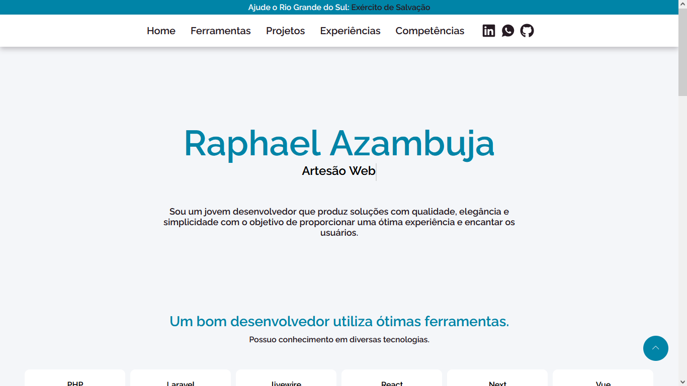

# Meu portfólio

Este é o repositório do meu portfólio online, desenvolvido utilizando o framework Next.js.

## Link para o Portfólio

Você pode acessar o portfólio através do seguinte link:

[raphaelazambuja.github.io/portfolio-v2/](https://raphaelazambuja.github.io/portfolio-v2/)

## Uso do Next.js

Este portfólio foi desenvolvido utilizando Next.js, um framework React que oferece diversas funcionalidades avançadas como:

- **Renderização do Lado do Servidor (SSR):** Melhora a performance e SEO do site.
- **Geração de Sites Estáticos (SSG):** Permite que páginas sejam geradas estaticamente em build time, resultando em um desempenho muito rápido.

Escolhi Next.js porque é o framework da biblioteca que estou aprendendo na faculdade e ele proporciona uma excelente experiência de desenvolvimento, além de ser altamente utilizado na indústria.
